# Desk Bot — Entity Relationship Diagram (ERD)

Covers the full data model: **Phase 1.5 (shipped)** tables plus **Phase 2 (planned)** additions from the [PRD](./PRD.md). Storage is SQLite (`node:sqlite`), single database at `backend/data/desk-bot.db`.

🔒 = value encrypted at rest (AES-256-GCM, key from `VAULT_KEY` in `.env`)

```mermaid
erDiagram

    %% ───────── Phase 2: Mail ingestion ─────────

    MAIL_ACCOUNTS {
        text    id PK "uuid"
        text    emailAddress
        text    label "personal | work | ..."
        text    status "connected | error | revoked"
        text    connectedAt
    }

    ALLOWLIST_ENTRIES {
        text    id PK "uuid"
        text    accountId FK
        text    pattern "sender address or Gmail label"
        text    kind "sender | label"
        text    type "transactional | newsletter"
    }

    OAUTH_TOKENS {
        text    id PK "uuid"
        text    accountId FK
        text    service "gmail | gcal"
        text    refreshTokenEnc "🔒"
        text    scope "read-only"
        text    updatedAt
    }

    PROCESSED_EMAILS {
        text    gmailMessageId PK
        text    accountId FK
        text    sender
        text    subject
        text    processedAt
        text    outcome "extracted | skipped"
        text    reason "skip reason, nullable"
    }

    DIGEST_ITEMS {
        text    id PK "uuid"
        text    headline
        text    sourceSender
        text    accountId FK
        text    sourceEmailId FK
        text    receivedAt
        text    expiresAt "receivedAt + 5 days"
    }

    %% ───────── Phase 2: Secure vault ─────────

    IDENTITY_VAULT {
        text    key PK "fullName | dob | mobile | pan | accountNumber:label"
        text    valueEnc "🔒"
        text    updatedAt
    }

    DOCUMENT_PASSWORDS {
        text    id PK "uuid"
        text    senderPattern
        text    passwordEnc "🔒"
        text    lastUsedAt
        text    createdAt
    }

    %% ───────── Core stores (Phase 1.5, extended in Phase 2) ─────────

    PORTFOLIO {
        text    id PK "uuid"
        text    symbol
        text    name
        text    type "stock | mutual_fund"
        real    quantity
        real    avgPrice
        text    exchange
        integer watchlistOnly "0 | 1"
        text    source "manual | email (P2)"
        text    sourceEmailId FK "nullable (P2)"
        text    added_at
    }

    REMINDERS {
        text    id PK "uuid"
        text    title
        text    time "HH:MM"
        text    days "daily | JSON array"
        integer active "0 | 1"
        text    note
    }

    EVENTS {
        text    id PK "uuid"
        text    title
        text    date "YYYY-MM-DD"
        text    time "HH:MM, nullable"
        text    description
        text    type "event | task"
        text    source "manual | email | gcal (P2)"
        text    sourceRef "gcal eventId or emailId (P2)"
    }

    TASKS {
        text    id PK "uuid"
        text    title
        text    due "YYYY-MM-DD, nullable"
        text    priority "high | medium | low"
        text    source "manual | email (P2)"
        text    sourceEmailId FK "nullable (P2)"
        integer done "0 | 1"
    }

    BILLS {
        text    id PK "uuid"
        text    vendor
        real    amount
        text    currency
        text    dueDate "YYYY-MM-DD"
        text    status "due | paid | unknown"
        text    sourceEmailId FK
    }

    %% ───────── Display & app state (Phase 1.5) ─────────

    SETTINGS {
        text    key PK "non-sensitive config only"
        text    value
    }

    HISTORY {
        text    id PK "uuid"
        text    type "contentType shown"
        text    summary
        text    layoutFingerprint "primitive set hash (P2)"
        text    timestamp "max 10 rows kept"
    }

    DISPLAY_CACHE {
        integer id PK "always 1 (singleton)"
        text    html
        text    contentType
        text    decision
        text    timestamp
        integer generating "0 | 1"
    }

    %% ───────── Relationships ─────────

    MAIL_ACCOUNTS ||--o{ ALLOWLIST_ENTRIES : "scopes ingestion"
    MAIL_ACCOUNTS ||--o{ OAUTH_TOKENS      : "authenticates via"
    MAIL_ACCOUNTS ||--o{ PROCESSED_EMAILS  : "ingests"
    MAIL_ACCOUNTS ||--o{ DIGEST_ITEMS      : "sources"

    PROCESSED_EMAILS ||--o{ TASKS        : "extracted into"
    PROCESSED_EMAILS ||--o{ EVENTS       : "extracted into"
    PROCESSED_EMAILS ||--o{ BILLS        : "extracted into"
    PROCESSED_EMAILS ||--o{ PORTFOLIO    : "extracted into"
    PROCESSED_EMAILS ||--o{ DIGEST_ITEMS : "digested into"

    IDENTITY_VAULT     ||..o{ PROCESSED_EMAILS : "computes doc passwords for"
    DOCUMENT_PASSWORDS ||..o{ PROCESSED_EMAILS : "unlocks attachments of"

    HISTORY       ||..|| DISPLAY_CACHE : "informs no-repeat logic"
```



## Notes

### Grouping

| Group | Tables | Phase |
|---|---|---|
| Mail ingestion | `mail_accounts`, `allowlist_entries`, `oauth_tokens`, `processed_emails`, `digest_items` | 2 |
| Secure vault | `identity_vault`, `document_passwords`, (`oauth_tokens` values) | 2 |
| Core stores | `portfolio`, `reminders`, `events`, `tasks`, `bills` | 1.5 (+P2 columns), `bills` new in 2 |
| Display & state | `settings`, `history`, `display_cache` | 1.5 |

### Design decisions reflected here

1. **Provenance everywhere (auditability).** Every fact extracted from email carries `sourceEmailId` → `processed_emails`, so the review queue can always show *which email* produced a task/bill/trade, and re-runs can never double-count.
2. **Sensitivity boundary is visible in the schema.** Encrypted values (🔒) live only in `identity_vault`, `document_passwords`, and `oauth_tokens` — never in `settings`. "Delete all vault data" wipes exactly these three tables.
3. **Allowlist entries are first-class rows**, not a JSON blob, so each sender carries its own `transactional | newsletter` type and can be managed individually in the admin panel.
4. **`display_cache` is a singleton** (one row, `id = 1`) — the display is a cache, not a log; `history` (capped at 10 rows) provides the anti-repetition memory, extended in Phase 2 with `layoutFingerprint`.
5. **Reminders are standalone** — they are user-authored recurring alarms, deliberately not fed by ingestion.
6. **Dotted relationships** are logical (runtime lookups), not SQL foreign keys: vault/passwords are consulted *during* processing; history informs the render prompt.
7. **Soft FKs.** SQLite FK constraints are used where practical, but `sourceEmailId`/`sourceRef` on core stores stay nullable soft references so manual entries need no email row.
```
